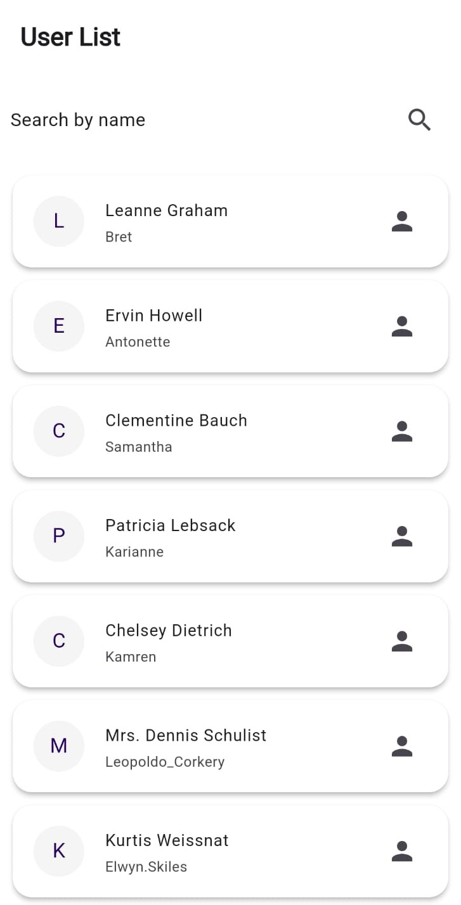
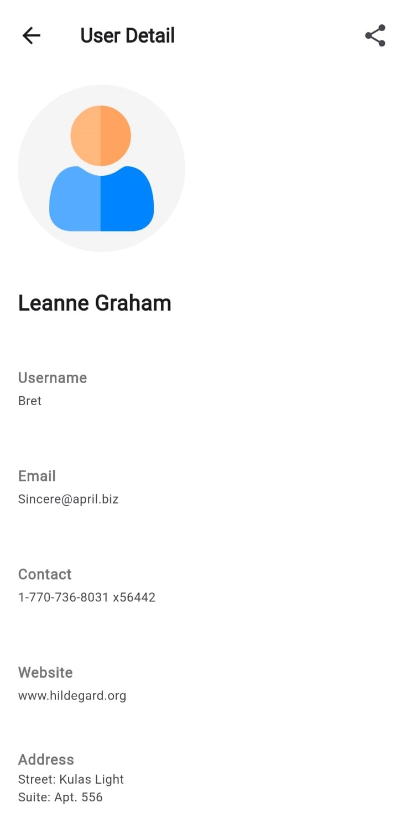
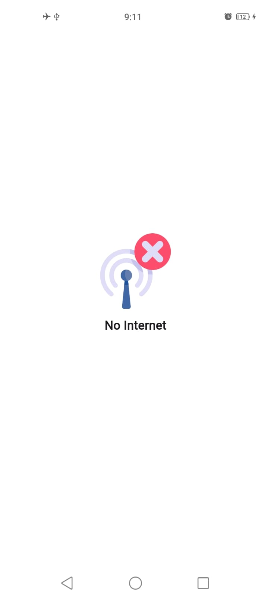

# User App

## Description

User App is a Flutter application designed to manage and display user information. The app features a user list with search functionality, a detailed user view with sharing capabilities, and offline handling for connectivity issues. It utilizes the BLoC pattern for state management and Retrofit with Dio for API interactions.

## Features

- **User List Screen**: Displays a list of users with a search bar for filtering results.
- **User Detail Screen**: Shows detailed information about a selected user and includes an option to share user details.
- **Internet Connectivity Handling**: Displays a screen when there is no internet connection.
- **State Management**: Implements BLoC pattern for state management.
- **API Interaction**: Uses Retrofit with Dio for fetching user data from a remote API.

## Project Structure

- `main.dart`: Entry point of the application. Sets up BLoC for internet connectivity and determines which screen to show based on connectivity status.
- `lib/ui/UserList/UserListScreen.dart`: Displays a list of users with a search bar. Fetches user data and updates UI based on BLoC state.
- `lib/ui/UserDetail/UserDetailScreen.dart`: Shows detailed information about a selected user and provides an option to share user details.
- `lib/ui/InternetDisconnected/InternetDisconnected_Screen.dart`: Displays a message when there is no internet connection.
- `lib/network/api_service.dart`: Defines API endpoints and provides methods for interacting with the API using Retrofit and Dio.
- `lib/data/repository/user_repository.dart`: Manages data fetching from the API.
- `lib/blocs/userList_bloc/user_list_bloc.dart`: Manages state for the user list screen.
- `lib/blocs/internetConnectivity_bloc/internet_connectivity_bloc.dart`: Manages state for internet connectivity.

## Dependencies

- **flutter_bloc**: For state management using BLoC pattern.
- **dio**: For making HTTP requests.
- **retrofit**: For defining and using APIs.
- **connectivity_plus**: For monitoring internet connectivity.
- **animated_search_bar**: For animated search bar functionality.
- **share_plus**: For sharing user details.

## API Endpoints

- **GET /users**: Fetches a list of users.
- **GET /user/{id}**: Fetches details of a user by ID.

## Usage

### Main Screen

When the app starts, it checks for internet connectivity:

- If connected, it displays the `UserListScreen` where users can search and view a list of users.
- If disconnected, it shows the `InternetDisconnectedScreen`.

### User List Screen

- **Search Bar**: Users can search for users by name. The search results update dynamically.
- **User List**: Displays a list of users. Tapping on a user navigates to the `UserDetailScreen`.

### Screenshot



### User Detail Screen

- Displays detailed information about the selected user.
- **Share Button**: Allows sharing of user details.

### Screenshot



### Offline Screen

- Shows an image and message when the app detects no internet connection.

### Screenshot



## Contributing

Contributions are welcome! Please fork the repository and submit a pull request with your changes.


## Installation

1. Clone the repository:
   ```bash
   git clone

2. Install the dependencies:
    flutter pub get

3. Run the app
    flutter run
